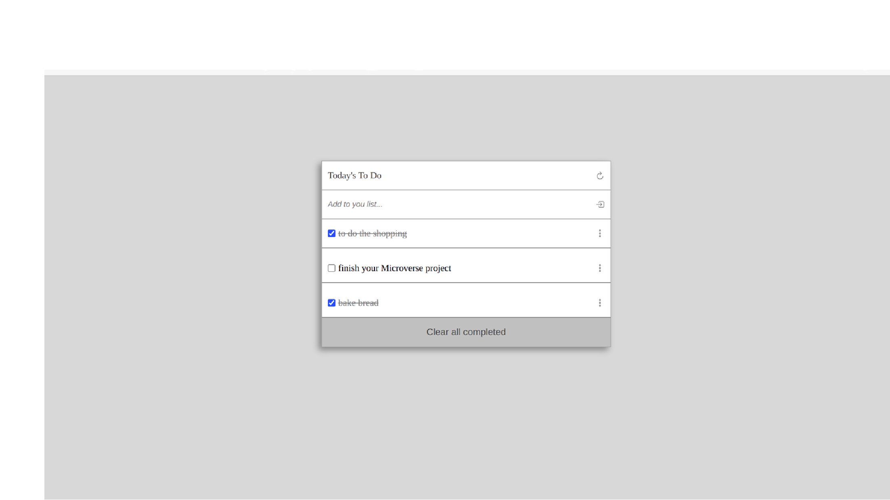

# To-Do List

> This project comprises a simple list of To Do tasks.

On this To-Do list, items can be added. When tasks completed, marked them as so and later, you can delete them.

## Built With

- Major languages: HTML, CSS, JavaScript;
- Technologies used: Git, GitHub, Webpack;

## Live Demo

[Live Demo Link - with netlify](https://to-do-list-by-nicu-pop.netlify.app/)

## Setup

To get a local copy up and running follow these simple example steps.

To setup the webpack project starting template in your local, in the repo page:
click on code (dropdown list) > Download as ZIP.
or open terminal of path you want to install project and run this command  
`git clone git@github.com:nicupop729/To-Do-list.git`

### Deployment

To run the project open folder (after extraction) or cloning then run these commands:  
**`npm install`** to install all dependencies  
**`npm start`** to start the application, you should see the application working at: `http://localhost:8080/`

## Author

👤 **Nicolae Pop**

- GitHub: [@nicupop729](https://github.com/nicupop729)
- Twitter: [@nicupop729](https://twitter.com/nicupop729)
- LinkedIn: [LinkedIn](https://www.linkedin.com/in/nicolae-pop/)

## Acknowledgments

- This is Microverse project
- Inspiration: [web.archive.org](https://web.archive.org/web/20180320194056/http://www.getminimalist.com:80/)

## 📝 License

This project is [MIT](./MIT.md) licensed.
